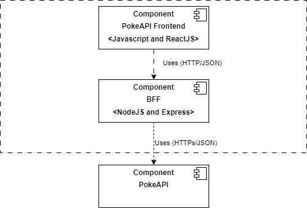

# BFF & Front-end for PokeAPI

Done with: 
<br>


## How to run

### Dev and Tests
#### We highly suggest you to use Docker for this purpose, and the instructions are pretty straight foward. 
 

### Frontend

1. Navigate to the [`front/`](command:_github.copilot.openRelativePath?%5B%22front%2F%22%5D "front/") directory:

```sh
cd front/
```

2. Build the Docker image:

```sh
docker build -t front-dev .
```

3. Run the Docker container:

```sh
docker run -p 3000:5000 front-dev
```

Your frontend application should now be accessible at `http://localhost:3000`. You can use it as is

### BFF

1. Navigate to the [`bff/`](command:_github.copilot.openRelativePath?%5B%22bff%2F%22%5D "bff/") directory:

```sh
cd ../bff/
```

2. Build the Docker image:

```sh
docker build -t bff-dev .
```

3. Run the Docker container:

```sh
docker run -p 3001:3001 bff-dev
```
### Now done with it, it's mandatory have BFF and Frontend running for the app to work.

### Deployment
#### You can use your cloud of choice to deploy the docker images.

## Diagrams
### Component diagram:


## Architecture
Below provides an overview of the architecture of the component, consisting of a frontend and a Backend for Frontend (BFF). This section explains the general structure, the responsibilities of each component, and how they interact to deliver functionality to the end-user.

### Frontend
The frontend is the user interface through which users interact with our system. It is designed using modern web technologies such as HTML, CSS, JavaScript, and the REACT library. The frontend is responsible for the presentation and user interaction.

#### Responsibilities
* Rendering the user interface.
* Interacting with users through events and actions.
* Consuming data from the Backend for Frontend (BFF) to display dynamic information.

### Backend for Frontend (BFF)
The Backend for Frontend (BFF) is a server-side component specifically designed to support the frontend's needs. It acts as an intermediary layer between the frontend and underlying services. In this repository, the external service is the pokeapi API. The BFF is intended to provide specific data and functionalities needed for the frontend, reducing complexity and migrating system coupling.

#### Responsibilities
* Adding an abstraction layer between the frontend and underlying services.
* In the future, it can be used to orchestrate calls to multiple services and consolidate data to reduce network traffic, acting similarly to the [Gateway Aggregation Pattern](https://lafilosofiadelsoftware.com/index.php/2023/08/23/patrones-arquitectonicos-en-gateways-y-donde-aplicarlos/).
* Providing a specific application programming interface (API) for the frontend.

### Interaction between Frontend and BFF
Communication between the frontend and the BFF occurs through HTTP requests. The frontend makes requests to the BFF to obtain specific data. The BFF processes these requests, makes necessary calls to the underlying pokeapi service, and returns the data to the frontend in an appropriate format.

The BFF acts as an abstraction layer between the frontend and underlying services, facilitating integration and adaptation of data and functionalities specific to the frontend's needs. Although it's acknowledged that in this specific case the BFF might be overdesigned, as it only communicates with one underlying service, it was implemented to understand this pattern and to have a focused interface for adding potential future improvements, such as implementing new external services.
